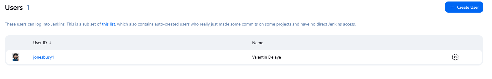
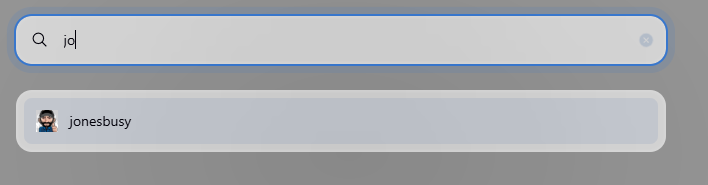

# Gravatar Plugin

This plugins shows [Gravatar](http://gravatar.com/) avatars instead of
the generic user image.

Also on the search pallet

## Usage

After installation, the plugin will automatically show Gravatars for the users who have an email and a Gravatar. No extra configuration needed except installing the plugin.

## Caveats

The plugin will re-check every 30 minutes to see if any user has
configured a Gravatar. Therefore, if you have configured a Gravatar and it does
not show up, please wait at least 30 minutes before thinking it is a bug.
